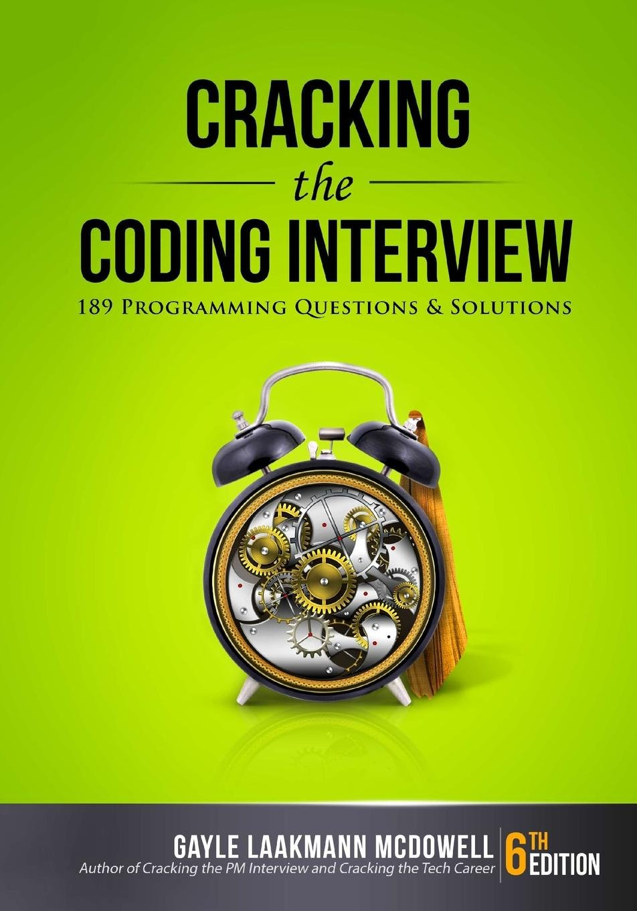
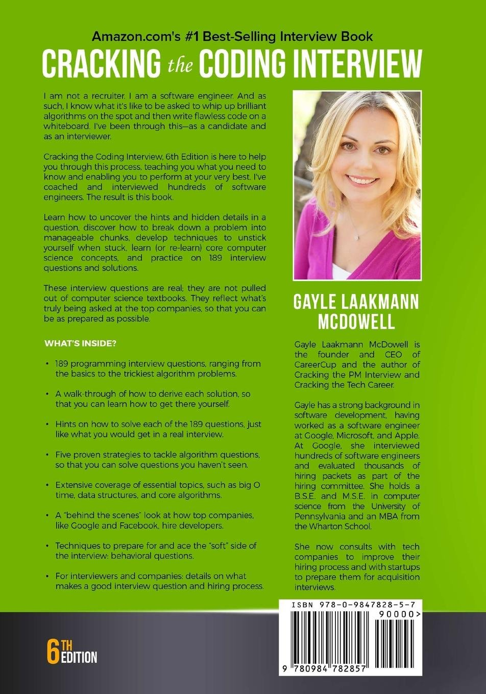

# Cracking-the-Coding-Interview

  

Cracking the Coding Interview, 6th Edition is here to help you through this process, teaching you what you need to know and enabling you to perform at your very best.

Learn how to uncover the hints and hidden details in a question, discover how to break down a problem into manageable chunks, develop techniques to unstick yourself when stuck, learn (or re-learn) core computer science concepts, and practice on 189 interview questions and solutions.

These interview questions are real; they are not pulled out of computer science textbooks. They reflect what's truly being asked at the top companies, so that you can be as prepared as possible. **WHAT'S INSIDE?**
* 189 programming interview questions, ranging from the basics to the trickiest algorithm problems.
* A walk-through of how to derive each solution, so that you can learn how to get there yourself.
* Hints on how to solve each of the 189 questions, just like what you would get in a real interview.
* Five proven strategies to tackle algorithm questions, so that you can solve questions you haven't seen.
* Extensive coverage of essential topics, such as big O time, data structures, and core algorithms.
* A behind the scenes look at how top companies like Google and Facebook hire developers.
* Techniques to prepare for and ace the soft side of the interview: behavioral questions.
* For interviewers and companies: details on what makes a good interview question and hiring process.

  

If you have any questions about the solutions you can find here, feel free to contact me **abhisheksharma.0517@gmail.com**.
